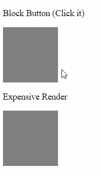
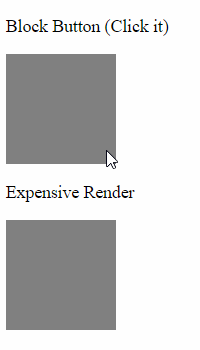

Inferno Render Delay
===========================

[](https://www.npmjs.com/package/inferno-render-delay)

Delay the (re)rendering of stateless components by a set amount of time.

In Javascript, sometimes we use `setTimeout` to make sure that the renderer gets ran
before any major thread-blocking computations. This small higher-order component
allows us to do this with Inferno components without adding additional state to otherwise
simple components.

# Installation

```
npm install inferno-render-delay
```

# Documentation

```typescript
function withRenderDelay(wrappedComponent, options?)
```

- `wrappedComponent`: The stateless component to be delayed.

- `options`
  - `delay` _(number)_: Length of the delay in millisceonds. Defaults to 1.
  - `delayFirstRender` _(bool)_: True to delay the initial render. Defaults to false.

# Example

```jsx harmony
const Message = (props) => <p>{props.text}</p>
const DelayedMessage = withRenderDelay(Message, { delay: 500, delayFirstRender: true })

render(
  <div>
    <Message text="hello" />
    <DelayedMessage text="world" />
  </div>, 
  document.getElementById('root')
)
```

# Use Cases

#### Simple Delay

No Delay  | Delay
------|------
 | 


----

#### Deferring Expensive Computations

No Delay  | Delay
------|------
 | 

----

#### Waiting For User Input

No Delay  | Delay
------|------
 | 